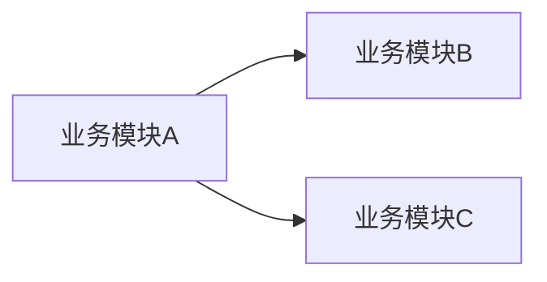

# {{project_name}}_详细设计文档

> 9 节标准结构, 由 software-factory Stage 2 (详细设计) 产出为 .docx.
> 若工作空间存在"详细设计模板.docx", 用其作为样式基线.
>
> **v0.5.5 编号策略**: Heading 1/2/3 文本里**手写** "一、 / 1.1 / 1.1.1" 等中文 / 阿拉伯编号. 同时**强制**调 scripts/fix_docx_headings.py 把模板自身绑到 Heading 的 numId 置 0 (关掉模板自动编号). **v0.5.5 起 fix_docx_headings.py 默认不剥手写前缀** (v0.5.1 时代的剥除是 bug, 因 numId=0 后手写编号是唯一来源). 最终渲染 = 单一手写编号.

## 一、文档说明

### 1.1 内容概要

### 1.2 项目背景

### 1.3 术语定义

| 术语 | 解释 |

### 1.4 参考资料

## 二、总体设计

### 2.1 架构图

`03_<项目名>_架构图.png` 在此插入 (按业务模块展示, 不是技术分层).

### 2.2 技术栈

| 层 | 选型 | 版本 | 理由 |
|----|------|------|------|

### 2.3 模块划分 (业务模块维度)

> ⚠️ 必须按"业务模块"划分 (例: 首页 / 节点管理 / 用户管理), **不能**按 SpringBoot 技术分层 (controller / service / dao / repository).

| 业务模块 | 问题描述 | 职责 | 入口 (URL/API) | 依赖 |
|----------|----------|------|----------------|------|

### 2.4 模块关系图

业务模块间调用关系 (箭头 / 树状 / mermaid 均可):

## 三、模块设计

### 3.1 业务模块: <模块名>

> 每个核心业务模块单独成节, 描述: 问题域 / 输入 / 输出 / 关键算法.

| 项 | 描述 |
|----|------|
| 问题域 | 该模块解决什么业务问题 |
| 输入 | 用户操作 / 外部事件 / 其他模块调用 |
| 输出 | 业务结果 / 数据变更 / 事件 |
| 关键类 | (列出核心类或 Service) |

## 四、接口设计

| Method | Path | 用途 | 鉴权 |
|--------|------|------|------|

## 五、数据库设计

> 仅有 DB 时才产出本节; 若无 DB 请注明 "本项目不引入数据库".

### 5.1 实体关系

### 5.2 表结构

### 5.3 索引

### 5.4 SQL DDL

完整 SQL DDL 落地到 `源代码/<项目名>-server/src/main/resources/schema.sql`.

## 六、界面设计

> 前端型项目.

### 6.1 页面布局

### 6.2 关键交互

### 6.3 状态机

## 七、部署与运行

| 步骤 | 命令 |
|------|------|

## 八、错误处理

| 场景 | 响应 |
|------|------|

## 九、附录

### 9.1 版本变更

### 9.2 TODO / 后续

### 9.3 联系方式