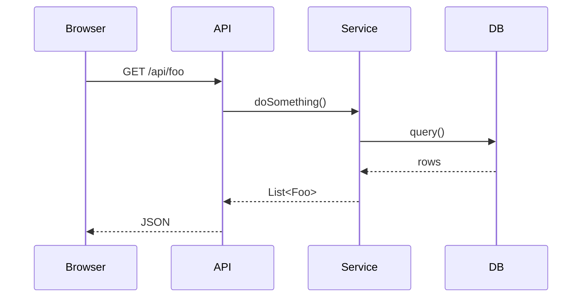

# {{project_name}}_架构设计

> 由 software-factory Stage 3 产出.
> ⚠️ 本文档**按业务模块维度**组织, 不是按 SpringBoot 技术分层 (controller/service/repository).

## 架构总览 (业务模块视图)

```
[业务模块A: 首页]
      │
      ▼ 调用
[业务模块B: 节点管理] ──► [业务模块C: 用户管理]
      │                       │
      ▼                       ▼
[数据访问层 (基础设施, 仅 DB 落地)]
```

> 上图仅示意业务模块关系, 真正的系统架构图见 `03_<项目名>_架构图.png` (由 `scripts/render_arch.py` 自动生成).
> PNG 内容**强制要求**是按业务模块绘制, 不得画 "接入层/应用层/服务层/数据层/基础设施层" 等 SpringBoot 技术分层.

## 业务模块划分

| 业务模块 | 问题描述 | 职责 | 入口 (URL/API) | 依赖 |
|----------|----------|------|----------------|------|
| | | | | |

> 表格说明: 每个业务模块单独一行, 必须写清"该模块要解决的业务问题" (而不是"它是 controller 还是 service").

## 模块关系 (业务模块架构图)

由 `scripts/render_arch.py` 读取下方"分层架构描述 (render_arch.py 输入)"表格, 自动出 PNG.

## 分层架构描述 (render_arch.py 输入)

> ⚠️ 此表是给 `scripts/render_arch.py` 解析用的输入, **业务模块名**应填在这里 (作为层), 不是技术分层.
> 下面是按业务模块的示例, 请按当前项目替换:

| 业务模块 | 主要组件 |
|----------|----------|
| 首页 | 概览仪表盘 + 关键指标 |
| 节点管理 | 节点注册 / 健康检查 / 上下线 |
| 用户管理 | 用户增删改查 / 角色权限 |
| 数据访问层 | JPA / MyBatis / Repository (基础设施, 仅说明 DB 落地) |

## 技术栈

| 层 | 选型 | 版本 | 理由 |
|----|------|------|------|

## 类 / 服务设计

(按业务模块分小节, 不是按 controller/service/repository)

### 业务模块: <模块名>

- 核心 Service: ...
- 核心 Entity: ...
- 关键算法 / 流程: ...

## 时序图 (mermaid)



## 部署拓扑

## 横切关注点

- 日志 / 异常 / 配置 / 安全 / 可观测

## ⚠️ 反例 (禁止)

下面这些是**禁止**在架构图和模块划分里出现的 SpringBoot 技术分层命名:

| 禁用 (技术分层) | 应该改为 (业务模块) |
|------------------|----------------------|
| 接入层 / 表现层 / 路由层 / API 网关层 | 用业务角色名 (例: 前台 / 后台 / 用户端 / 管理端) |
| 应用层 / 服务层 / 领域层 | 业务模块名 (例: 节点管理 / 用户管理 / 工单管理) |
| 持久层 / 数据访问层 / Repository 层 | 仅在"数据访问"模块下注明, 不作为顶层模块 |
| 基础设施层 | 仅在备注中说明 (Docker / 监控 / DB), 不作为架构图主层 |

> 详见 `prompts/architecture.md` Step 2 (业务模块强约束).